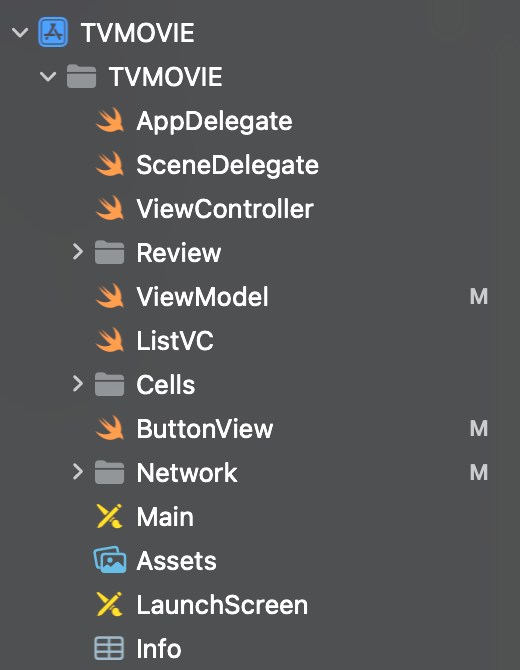
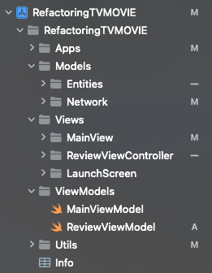
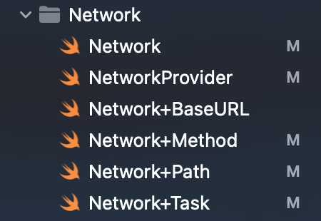
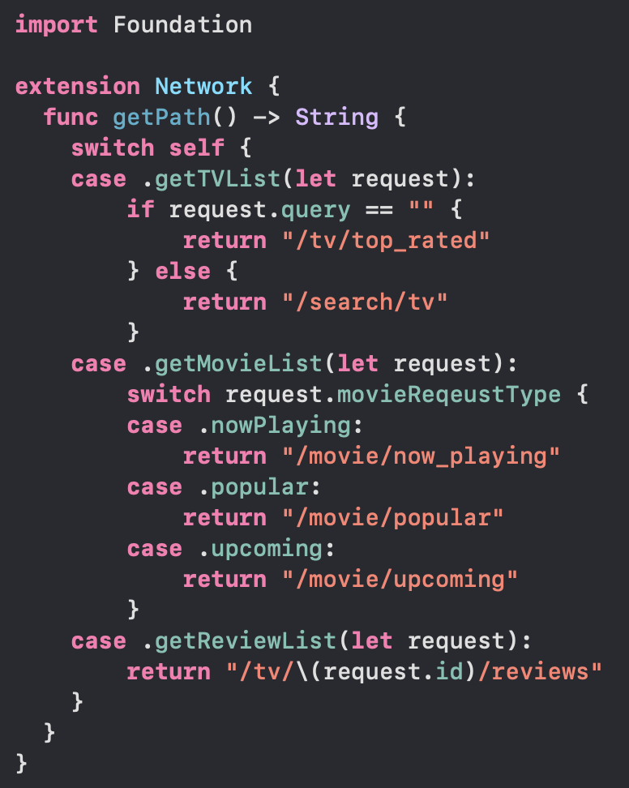
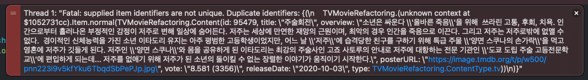
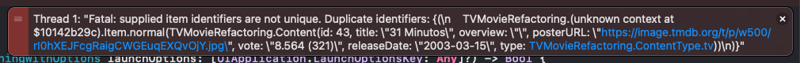

# RefactoringTVMOVIE

## 프로젝트 소개 
영화와 TV 시리즈의 데이터를 API를 통해 받아오는 앱으로,  
`MVVM` 패턴과 `RxSwift`, `Modern Collection View`를 사용하여  
진행된 강의의 프로젝트를 복습하면서 내부 로직을 **리팩토링**하였습니다.

## 리팩토링
### 파일 구조가 명확해지도록 그룹화   
**그룹화 전**  
  
**그룹화 후**  
  

디자인 패턴에 맞게 파일들을 다음과 같이 그룹화하였습니다.  
- **Models**: 네트워킹을 포함한 데이터 로직  
  - Entities: 네트워크에서 받아올 데이터의 타입을 정의  
  - Network: Provider를 포함한 네트워킹 로직  
- **ViewModel**: View의 입력을 받아 Model에 데이터 요청 및 수신, Model의 데이터를 가공  
- **Views**: UI, 주어진 데이터를 통해 화면에 표시  
- **Utils**: Secrets 파일 및 Enum, Protocol 정의
<br>

### 네트워킹 라이브러리 변경(RxAlamofire -> Moya)   
기존 `RxAlamofire`에서 `Moya`로 네트워킹을 위한 라이브러리를 변경하였습니다.

- **변경 이유**
  - `RxAlamofire`의 마지막 Release가 2021년으로 현재 버젼의 `RxSwift`에 대응하지 않습니다.  
  - 개인적으로 `Alamofire`보다 `Moya`가 추상화에서 강점이 있다고 생각합니다.  
    (내부적으로 `URLSession`으로 돌아가는 `Alamofire`를 사용하는 이유가 추상화라고 생각합니다.)  

- **`Extension`을 활용하여 `Moya`의 `TargetType` 항목 분리**
  - `Moya`의 `TargetType`을 입력할 때 `Extension`을 활용하여 파일을 분리하였습니다.
  - 파일이 분리되어 유지,보수 측면에서 강점이 있을 것으로 기대됩니다.
**Extension 적용**

| |  |
|--|--|

#### 기존코드(RxAlamofire)
```swift
 func getItemList(path: String, language: String = "ko", page: Int? = nil, query: String? = nil) -> Observable<T> {
        var fullPath = "\(endpoint)\(path)?api_key=\(APIKEY)&language=\(language)"
        
        if let page = page {
            fullPath += "&page=\(page)"
        }
        
        if let query = query?.addingPercentEncoding(withAllowedCharacters: .urlQueryAllowed) {
            fullPath += "&query=\(query)"
        }
        
        return RxAlamofire.data(.get, fullPath)
            .observe(on: queue)
            .debug()
            .map { data -> T in
                return try JSONDecoder().decode(T.self, from: data)
            }
}
```
#### 변경된 코드(Moya)
```swift
enum Network {
    case getTVList(TVRequest)
    case getMovieList(MovieRequest)
    case getReviewList(ReviewRequest)
}

extension Network: TargetType {
    var baseURL: URL { self.getBaseURL() }
    var path: String { self.getPath() }
    var method: Moya.Method { self.getMethod() }
    var task: Task { self.getTask() }
    var headers: [String : String]? { return nil }
}
```

### 일반 변수로 들고있던 데이터를 `BehaviorRelay`와 같은 Rx타입으로 변경하였습니다.
- 이벤트가 발생할 때 새로운 tvList를 생성하여 currentTVList를 더해서 리턴하는 로직에서
- tvListRelay에 값을 적용하며 tvListRelay에 리턴하도록 변경되었습니다.
- 추후 데이터를 추가적으로 활용할 상황이 생긴다면 **이벤트 스트림을 통한 동작이 가능**해집니다.  

```swift
// 기존 코드
private var currentTVList: [TV] = []
// 변경
private let tvListRelay = BehaviorRelay<[TV]>(value: [])
```

#### 그 외 기타
- 접근만 필요한 변수 `private(set)` 처리
- UI에 적용되는 바인딩 `.bind` -> `.drive` 변경
- 메인 뷰의 CollectionView 하위 뷰로 분리
- `View`에서 데이터를 화면에 맞게 변환하는 로직 제거  
   (`View`는 최대한 받아온 데이터만 사용하도록)  

## 에러 핸들링(서버 문제)
  
  
발생한 에러는 iD에 중복값이 있어 나타난 문제로,  
에러 로그를 보고 중복값을 없애 바로 해결하였습니다.  
<br>
기존 프로젝트에 로직이 추가된 코드로 해결했기 때문에 구조적인 문제를 찾으려고 하였으나  
<br>
시간에 따라 다른 에러가 발생하였고 기존 프로젝트도 동일한 에러가 발생한 것을 확인하고  
<br>
서버가 리턴하는 데이터의 문제인 것으로 결론내렸습니다.  

## 작업 Flow - TBD(Trunk Based Develop)
  - 단일한 브랜치(Main or Trunk)에 수시로 병합(merge)
  - 브랜치의 수명을 가능한 짧게 가져감
  - [TBD에 대한 내용을 정리한 블로그](https://dev-kang.tistory.com/36)

## 개발 및 테스트 환경 버전
  - Xcode 15.3
  - iOS 16+
  - iPhone15 시뮬레이터
  - Portrait Only
  - LightMode Only

## 프로젝트 실행 방법
```
프로젝트 빌드 시 Secrets.configs 파일이 필요합니다.
본 프로젝트 실행을 위해 파일이 필요할 시 spdlqjrkdrjs@naver.com으로 요청해주세요.
```
- git clone
```
git clone https://github.com/kangsworkspace/RefactoringTVMOVIE
```
- 현재 브랜치가 main에 있는지 확인하십시오.
- Simulator 기기를 iPhone15로 설정하고 빌드합니다.
<br>

## 구현 내용
 - <b> API를 통해 데이터 가져오기 </b>
 - <b> 페이징 처리 </b>
 - <b> 검색 </b>
 
|  |  |  |
|--|--|--|

 - <b> Modern Collection View 적용을 통한 동적인 UI </b>  
   [(Modern Collection View를 정리한 블로그 글)](https://dev-kang.tistory.com/39)  
    

## Library
- [RxSwift](https://github.com/ReactiveX/RxSwift)
- [Then](https://github.com/devxoul/Then)
- [Moya](https://github.com/Moya/Moya)
- [SnapKit](https://github.com/SnapKit/SnapKit)
- [Kingfisher](https://github.com/onevcat/Kingfisher)
